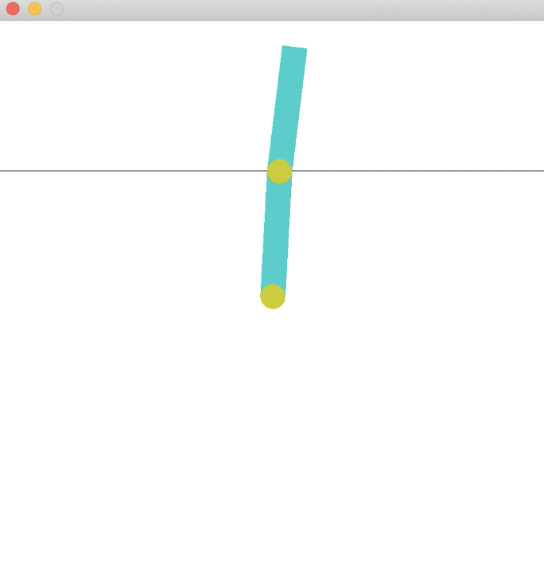

# DQN 

This project contains the source code for Q-learning with the DDQN trick. We implement the DDQN in two classific model provided by gyms, CartPole and Acrobot. 

The code is testes in the following enviroment.

- OpenAI Gym’s version of CartPole and Acrobot, which is provided in the source code
- Pytorch

The goal of the acrobot is change state from 'face down' to 'face up'. This is an example of final position of the Acrobot using our DQN controller. We implement the first stage of the algorithm, which is descibed above. The second stage is a similar task. It needs us to stablized the Acrobot to this unstable EQL. We need to train a new model to stablize it.

 

# Test result

For each iteration, the mini-batch size I use is 64. I track loss and average cumulative reward evaluated on 50 trajectories for each iteration. I update target network every 100 iterations. Each time I update the target network, the loss will increase as shown in figure 1. The average reward will increase and become stable over time. The average cumulative reward will converge to 200 eventually.
 
  
 
