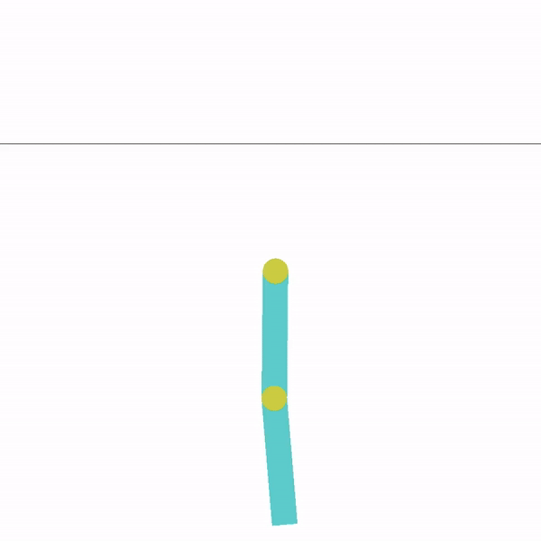
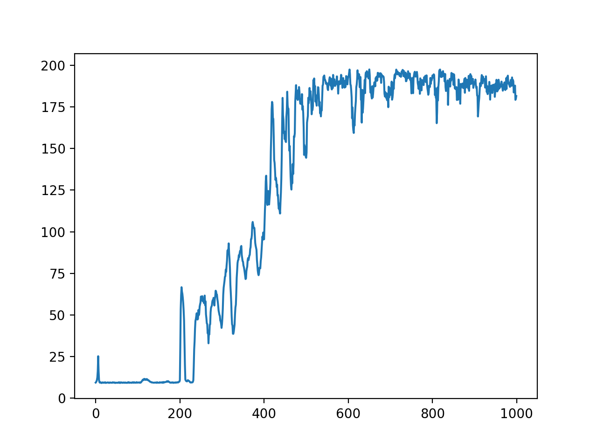

# Q-Learning

This project contains the source code for Q-learning with the DDQN trick. We implement the DDQN in two classific model provided by gyms, CartPole and Acrobot. 

The code is testes in the following enviroment.

- OpenAI Gym’s version of CartPole and Acrobot
- Pytorch

## Double Deep Q-Learning for Acrobot

The acrobot system includes two joints and two links, where the joint between the two links is actuated. Initially, the links are hanging downwards. The goal of the acrobot is to change the state from 'face down' to 'face-up'. This is an example of the final position of the Acrobot using our DQN controller. 

   

### TO DO

We implement the first stage of the algorithm, which is described above. The second stage is a similar task. It needs us to stabilized the Acrobot to this unstable EQL. We need to train a new model to stabilize it or use a traditional controller like LQR to stabilized the model at EQL.

## Double Deep Q-Learning for CartPole

A pole is attached by an un-actuated joint to a cart, which moves along a frictionless track. The system is controlled by applying a force of +1 or -1 to the cart. The pendulum starts upright, and the goal is to prevent it from falling over. A reward of +1 is provided for every timestep that the pole remains upright. The episode ends when the pole is more than 15 degrees from vertical, or the cart moves more than 2.4 units from the center.

### Training

For each iteration, the mini-batch size I use is 64. I track loss and average cumulative reward evaluated on 50 trajectories for each iteration. I update the target network every 100 iterations. Each time I update the target network, the loss will increase as shown in figure 1. The average reward will increase and become stable over time. 

   

 
The goal of the CartPole is to stay upright as long as possible. Without training the CartPole can easily fall down. With 2000 iterations of training using our network, the CartPole can stay upright.

   

